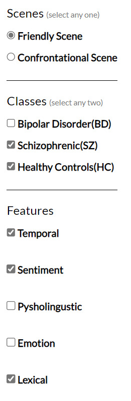

# CS 524 Final Project

# Visual Analysis of People Based on Medical Conditions

## Kushal Reddy Palvai (UIN: 677379211) | Sona Reddy Gudur (UIN: 650467244)

## Webpage -  [Link](https://Sonareddyg.github.io/) 

## Problem

Doctors and psychiatrists collect and analyze large amounts of data from their patients to better understand the nature of a patient's illness, determine appropriate treatments, and track the effectiveness of interventions over time. This data can include a wide range of information, such as medical history, lab results, family history, symptoms, and daily habits.

Analyzing and interpreting this data can be a time-consuming and complex process, which takes time away from treating patients. Visualizing the data in a clear and concise way can help doctors and psychiatrists understand the information more quickly, enabling them to focus on treating the person more effectively.

Visual analysis of people based on medical conditions could be a valuable tool for doctors and medical professionals to assist in diagnosis, treatment, and monitoring of patients. By analyzing visual cues doctors may be able to identify patterns and indicators that could help them make more accurate diagnoses or track the progression of a disease. 

## Data Summary 

The dataset is organized into two scenes, where each scene has items as rows and features as their attributes. The data comprises approximately 540 rows in each of the feature data for both scene 1 and scene 2. Each row represents the feature values of a single person. All the attributes in this dataset are measured and distinguished by the attribute label, which identifies three classes: Bipolar Disorder, Schizophrenic, and Healthy Controls. In total, there are 138 attribute features, including eight emotion attributes, two temporal attributes, three sentiment attributes, 118 psycholinguistic attributes, and seven lexical attributes.

The dataset is static. The label attribute is categorical, while the emotion and sentiment attributes are ordinal. The temporal attributes are quantitative and include max_time and mean_time. The psycholinguistic attributes are also quantitative and comprise 118 features, including WC, Clout, and Tone. The lexical attributes are also quantitative and measure the linguistic variety and richness of an item.

The dataset can be abstracted as information visualization using abstract data. It is a multivariate dataset with a total count of 138 attributes/variables.

## Research Challenges 

There are several research challenges that need to be addressed when working on visual analysis of people based on medical conditions:

1. Data collection and standardization: Collecting a large amount of reliable and standardized data that includes visual cues of people with different medical conditions is a challenging task. It requires a significant amount of time and resources to obtain data that is representative of the population.

2. Identifying relevant visual cues: There is a need to identify the most relevant visual cues that are indicative of specific medical conditions. This requires expert knowledge and experience in the field, as well as advanced statistical and machine learning techniques.

3. Privacy and ethical concerns: Visual analysis of people raises privacy and ethical concerns, particularly with regards to data sharing and storage. It is important to ensure that all data collected is protected and that strict privacy regulations are followed.

4. Model explainability: The models used to analyze visual data need to be explainable, so that medical professionals can understand the basis for a diagnosis or treatment recommendation. This requires the development of transparent and interpretable models that can be easily understood by non-experts.

## Instructions to Run the project

_Step 1_: Clone the Project

git clone https://github.com/Sonareddyg/Sonareddyg.github.io.git

_Step 2_: Run python server

Open the terminal and run the following command 

python -m http.server

_Step 3_: In localweb browser open the url `http://localhost:8080/` (default port: 8080)

_Step 4_: Once you see the webpage, firstly select the scene of your choice and then select appropriate classes and features for different visualizations. Click on the graph of density plot (sub features) to see the pictogram for each scenario. 

## Results

There are two scenes to choose from, friendly and confrontational, and three classes to choose from, bipolar disorder, healthy control, and schizophrenia. There are also five different features that can be used to compare the data which are temporal, sentiment, psycholinguistic, emotion and lexical. In the left panel, you can select one scene and two classes to compare, as well as one or more features to compare the data with.  

The histogram compares all selected features for the chosen classes. Clicking on a bar in the histogram displays a box plot for the selected feature. The box plot shows the distribution of the values for the selected sub-feature, including the minimum, average, and maximum values. 

In addition to the histogram and box plot, there is also a density plot for the selected feature. The density plot compares the two scenes and shows the variation of the specific sub-feature in both scenes. When hovering over each density curve, details are displayed, including which scene the curve belongs to and the sub-feature of which the curve is displayed.

Clicking on each density graph allows us to view the distribution of the detailed cohort for each sub-feature in both scenes. Hovering over each figure displays the class and sub-feature it belongs to, as well as the displayed value. For each density plot, the pictogram changes to show the variation of cohorts for each sub-feature in both scenes.

## Conclusion

Our project has the potential to advance the field of mental health by providing a new tool for analyzing and understanding the language patterns of individuals with mental disorders. This, in turn, can lead to improved diagnosis and treatment outcomes, ultimately benefiting individuals with mental disorders and the broader society. By providing a new and innovative approach to understanding mental health, our project has the potential to make a significant contribution to the field of mental health research and practice.

